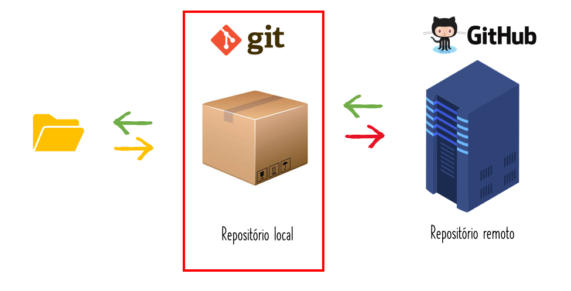
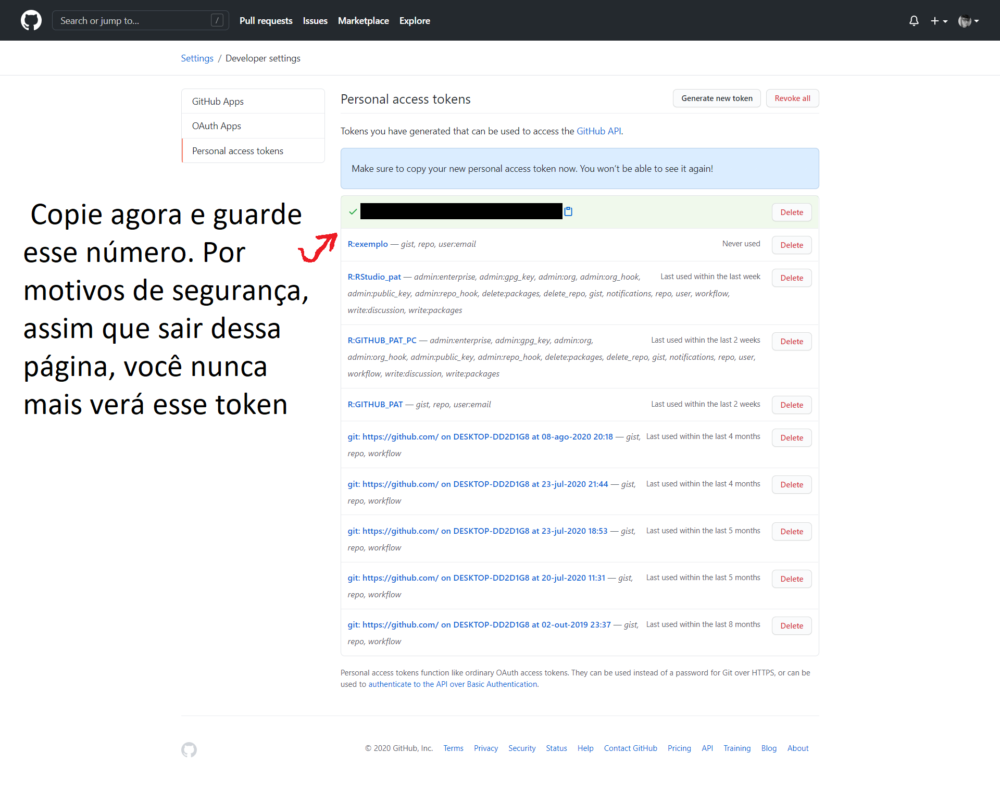
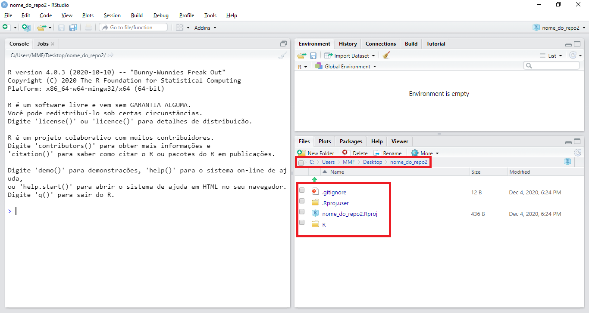
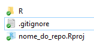
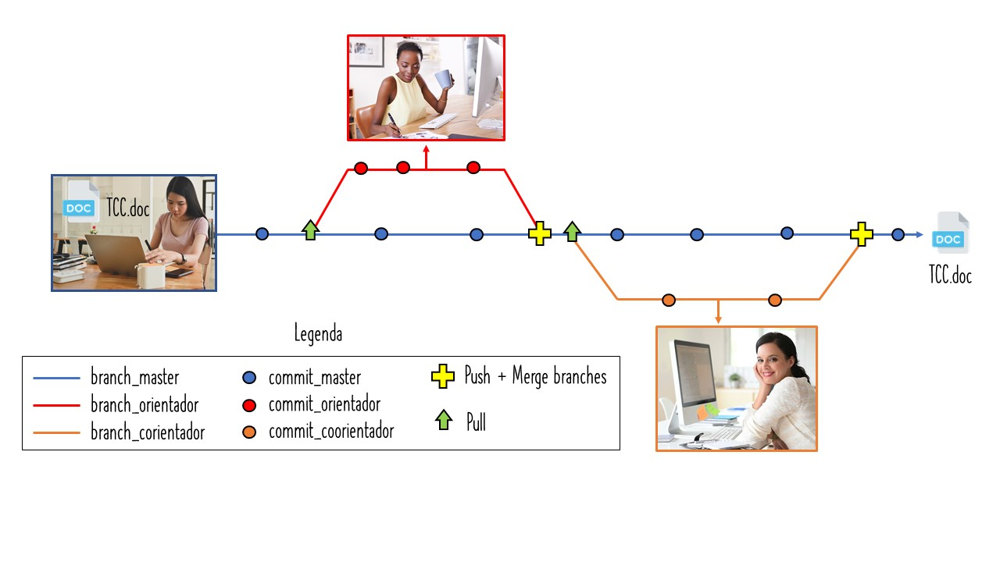
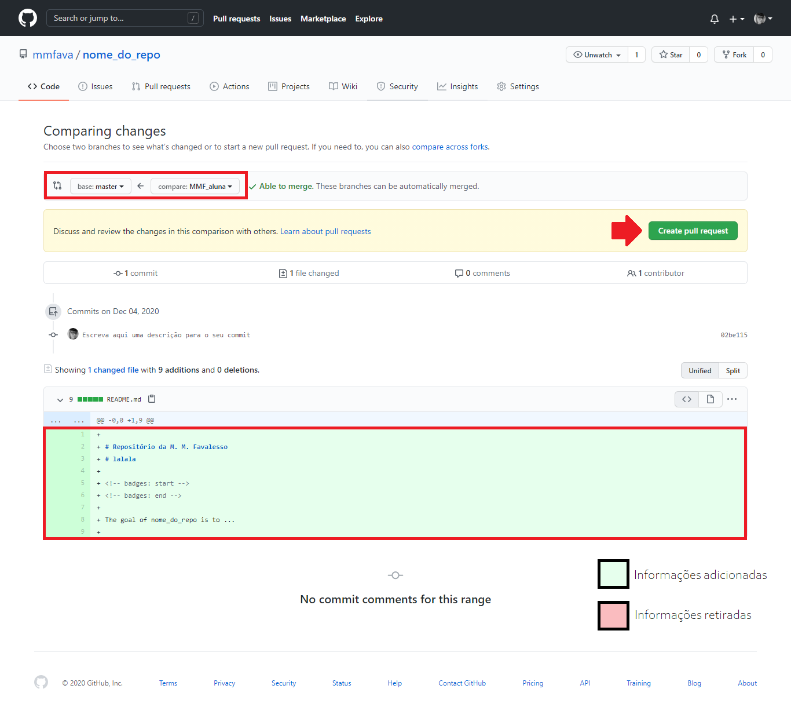
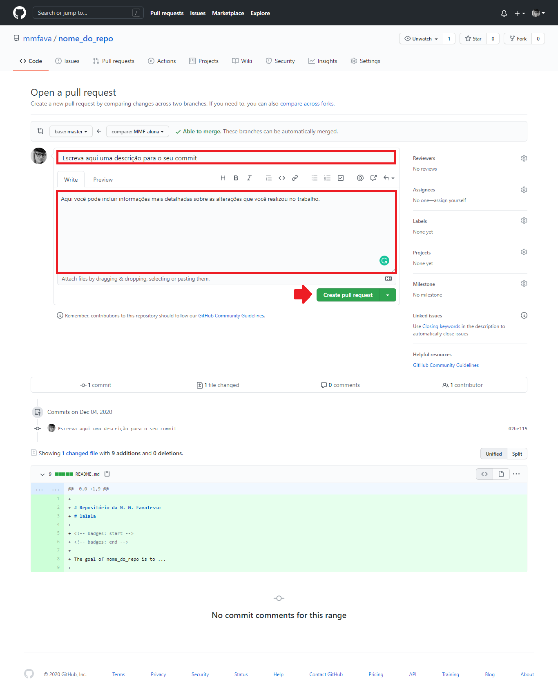
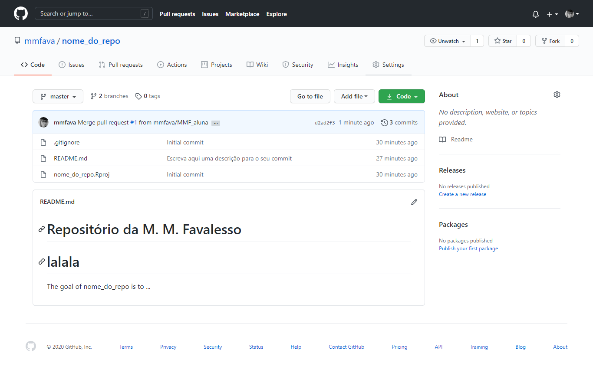
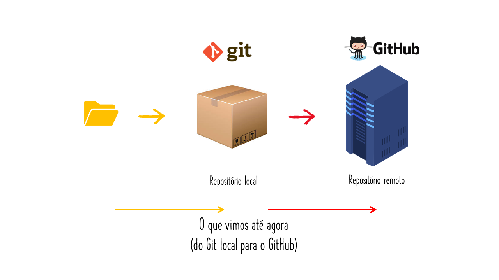
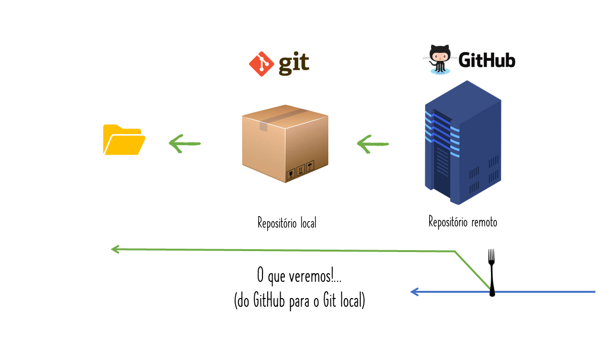

background-image: url(images/fig/me.jpg)
background-size: 300px
background-position: 90% 5%

```{css, echo=FALSE}
pre {
  max-height: 600px;
  overflow-y: auto;
}

pre[class] {
  max-height: 600px;
}
```

# Marília Melo Favalesso 
**Formação**
- Bióloga (UFPR - 2015) 
- Mestre em Ciências Ambientais (UNIOESTE- 2018) 
- Doutoranda em Ecologia (UBA - Argentina, 2018)

<p>

**Trabalho com:**
- Ecoepidemiologia
- Análise de dados geoespaciais
- Modelagem de nicho

**Projetos**
- **GECD** ([Grupo de Estudos em Ciência de Dados](https://github.com/gecdfoz/GECD) - Foz do Iguaçu)

**Contatos**
<br>
- `r icon::fa_envelope(colour = "pink")` [mariliabioufpr@gmail.com]()
<br>
- `r icon::fa_twitter(colour = "pink")` [@mmfbio](https://twitter.com/mmfbio)
<br>
- `r icon::fa_github(colour = "pink")` [/mmfava](https://github.com/mmfava)
<br>
- `r icon::fa_link(colour = "pink")` [mariliamelofavalesso.com](https://www.mariliamelofavalesso.com/)

---
class: clear
background-image: url(images/fig/Slide1.JPG)
background-size: 1000px

---
class: clear
background-image: url(images/fig/Slide2.JPG)
background-size: 1000px

---
class: clear
background-image: url(images/fig/Slide3.JPG)
background-size: 1000px

---
class: clear
background-image: url(images/fig/Slide4.JPG)
background-size: 1000px

---
class: clear
background-image: url(images/fig/Slide5.JPG)
background-size: 1000px

---
class: clear
background-image: url(images/fig/Slide6.JPG)
background-size: 1000px

---
class: clear
background-image: url(images/fig/Slide7.JPG)
background-size: 1000px

---
class: clear
background-image: url(images/fig/Slide8.JPG)
background-size: 1000px

---
class: clear
background-image: url(images/fig/Slide9.JPG)
background-size: 1000px

---
class: clear
background-image: url(images/fig/Slide10.JPG)
background-size: 1000px

---
class: clear
background-image: url(images/fig/Slide11.JPG)
background-size: 1000px

---
class: clear
background-image: url(images/fig/Slide12.JPG)
background-size: 1000px

---
class: clear
background-image: url(images/fig/Slide13.JPG)
background-size: 1000px

---
class: clear
background-image: url(images/fig/Slide14.JPG)
background-size: 1000px
---
class: clear
background-image: url(images/fig/Slide15.JPG)
background-size: 1000px

---
class: clear
background-image: url(images/fig/Slide16.JPG)
background-size: 1000px

---
class: clear
background-image: url(images/fig/Slide17.JPG)
background-size: 1000px

---
class: clear
background-image: url(images/fig/Slide18.JPG)
background-size: 1000px

---
class: clear
background-image: url(images/fig/Slide19.JPG)
background-size: 1000px

---
class: clear
background-image: url(images/fig/Slide20.JPG)
background-size: 1000px

---
class: clear
background-image: url(images/fig/Slide21.JPG)
background-size: 1000px

---
class: clear
background-image: url(images/fig/Slide22.JPG)
background-size: 1000px
---
class: clear
background-image: url(images/fig/Slide23.JPG)
background-size: 1000px

---
class: clear
background-image: url(images/fig/Slide24.JPG)
background-size: 1000px

---
class: clear
background-image: url(images/fig/Slide25.JPG)
background-size: 1000px

---
class: clear
background-image: url(images/fig/Slide26.JPG)
background-size: 1000px

---
class: clear
background-image: url(images/fig/Slide27.JPG)
background-size: 1000px

---

## Pré-requisitos 

-   Instalar o [R](https://cran.r-project.org/bin/windows/base/R-4.0.3-win.exe) e o [RStudio](https://rstudio.com/products/rstudio/download/) (lembre de sempre manter versões atualizadas!).

--

-   Fazer uma conta no [GitHub](https://github.com/). Se você é estudande, pode usar o seu e-mail institucional para obter alguns beneficios com o [GitHub Student Developer Pack](https://education.github.com/pack).

--

-   Instalar o [Git](https://git-scm.com/download/).

--

-   Instalar o pacote "[usethis](https://usethis.r-lib.org/)".

```{r eval=FALSE, include=TRUE}
install.packages("usethis")
```

---
## Configurar o Git no PC
.center[

]

---
## Configurar o Git no PC
### Pelo RStudio
- Após instalar todas as aplicações necessárias, nós vamos configurar o Git em nossas máquinas. Esse passo será feito uma única vez! <br />

- No RStudio você precisa escrever e executar a seguinte função com o nome e e-mail cadastrado em sua conta GitHub:

```{r eval=FALSE, include=TRUE}
usethis::use_git_config(user.name = "Fulana de tal", # Seu nome
                        user.email = "fulanadetal@email.com.br") # Seu email

```

---

## Configurar o Git no PC
### Pelo cmd do Git
Outra possibilidade é executar essa configuração diretamente no Git em sua máquina:


---
## Configurando o GitHub


---
## Configurando o GitHub
### Token de acesso pessoal (PAT)
- Um PAT é uma alternativa à senha que você usaria ao acessar sua conta GitHub. De forma simplificada, é uma chave semelhante a `48t979e5677b198592e5047da8a79f53bcasb4b10` que dará permissão para o *RStudio* acessar diretamente o seu GitHub. <br />

--

- Cada PAT pode ter uma configuração própria (veremos a seguir). <br />

--

- Para criar o token de acesso, vamos executar o comando que aparece na sequência. <br />


```{r eval=FALSE, include=TRUE}
usethis::browse_github_token()
```

- Ao executa-lo, uma página do GitHub irá abrir. Nessa páginá você poderá nomear o seu token e selecionar as permissões que irá conceder a ele. 

---
<div class="background" style="width: 1000px; height: 700px; white-space: nowrap; overflow-x: scroll; border: 0; padding: 10px;"> 


---
<div class="background" style="width: 1000px; height: 700px; white-space: nowrap; overflow-x: scroll; border: 0; padding: 10px;"> 



---
### Token de acesso pessoal (PAT)

- Agora vamos incluir o PAT nas configurações do nosso ambiente R. 

--

- Abra o arquivo `.Renviron`:

```{r eval=FALSE, include=TRUE}
usethis::edit_r_environ()

# * Modify 'C:/Users/MMF/Documents/.Renviron'
# * Restart R for changes to take effect
```
--

- No arquivo, digite `GITHUBPAT=NUMERO_TOKEN` <br />


--
- Após escreve-lo, pule uma linha e salve o arquivo. Na sequência, reinicie o RStudio com CTRL + SHIFT + F10.

---
class: center


**Tudo pronto para começarmos a trabalhar com o Git e o Github**

---
## Criar um repositório local pelo RStudio
.center[

]
---
## Criar um repositório local pelo RStudio
- Para criar um repositório local, vamos utilizar a função `create_project()` do pacote `usethis`. <br />
--
  - Com ela, você precisará fornecer um diretório e o nome do novo repositório em `path =`. <br />
--
  - CUIDADO para não repetir o nome de outros repositórios! <br />
--

```{r eval=FALSE, include=TRUE}
usethis::create_project(path = "C:/Users/MMF/Desktop/nome_do_repo2")

# v Creating 'C:/Users/MMF/Desktop/nome_do_repo/'
# v Setting active project to 'C:/Users/MMF/Desktop/nome_do_repo'
# v Creating 'R/'
# v Writing 'nome_do_repo.Rproj'
# v Adding '.Rproj.user' to '.gitignore'
# v Opening 'C:/Users/MMF/Desktop/nome_do_repo/' in new RStudio session
# v Setting active project to 'C:/Users/MMF/Dropbox/GitHub/GECD'

```

--
- O *RStudio* abrirá outra janela com o novo projeto criado.
---
## Criar um repositório local pelo RStudio

.center[

]
---
## Criar um repositório local pelo RStudio

- As próximas etapas serão aprender a salvar alterações  na linha do tempo do Git (`commit`) e envia-las para um repositório remoto (`push`). 

--

- É provável que nessa etapa uma **guia chamada “Git”** já tenha aparecido na sua IDE. Caso não, a próxima função que vamos utilizar (`use_git()`) vai adiciona-la. 

<div class="background" style="width: 1000px; height: 700px; white-space: nowrap; overflow-x: scroll; border: 0; padding: 10px;">


---
## Iniciar o repositório local

- Aqui vamos trabalhar na janela que o RStudio abriu após criar um novo projeto.

--

- Vamos usar a função `use_git()` para realizar o nosso primeiro `commit` (salvar nossos arquivos na linha do tempo) e dar inicio ao nosso repositório.

.center[

]

  - Quando realizamos um `commit` na linha do tempo, é importante descrever a mudança que foi realizada no(s) arquivo(s). 
  
--

- A função também adiciona arquivos importantes ao `.gitignore`.

  - O .gitignore especifica arquivos intencionalmente não rastreados para ignorar. 
  
--

- Na ausência da guia "*Git*", o programa irá pedir para reiniciar o *RStudio* com a finalidade de adiciona-la. 

---
.center[

]

---

```{r eval=FALSE, include=TRUE}
usethis::use_git(message = "Initial commit")

# √ Setting active project to 'C:/Users/MMF/Desktop/nome_do_repo'
# √ Initialising Git repo
# √ Adding '.Rhistory', '.RData' to '.gitignore'
# There are 2 uncommitted files:
# * '.gitignore'
# * '.nome_do_repo.Rproj'

# Is it ok to commit them?

# 1: No way
* # 2: Definitely
# 3: Absolutely not

# Selection: 2
# √ Adding files
  
# A restart of RStudio is required to activate the Git pane **<--**
# Restart now?
  
# 1: No way
* # 2: For sure
# 3: Negative
# Selection: 2
  
# √ Adding files
# √ Commit with message 'Initial commit'
```

---
## Do Git local para o GitHub

.center[

]

---
## Do Git local para o GitHub
- Agora que já **criamos um novo projeto no Git** e já **salvamos os arquivos iniciais criados** com um `commit`, o nosso próximo passo será **criar um repositório associado ao GitHub**, adicionando-o ao nosso repo local como uma origem remota, e então fazemos um `push` inicial para sincronizar os dois. 

  - `push` é a palavra em inglês para 'empurrar'. 

--

- Para tal, vamos usar a função `use_github()` do pacote `usethis`.

---

```{r eval=FALSE, include=TRUE}
usethis::use_github()

# √ Setting active project to 'C:/Users/MMF/Desktop/nome_do_repo'
# √ Checking that current branch is 'master'
# Which git protocol to use? (enter 0 to exit) 

# 1: ssh   <-- presumes that you have set up ssh keys
*# 2: https <-- choose this if you don't have ssh keys (or don't know if you do)

# Selection: 2

# * Tip: To suppress this menu in future, put
#   `options(usethis.protocol = "https")`
#   in your script or in a user- or project-level startup file, '.Rprofile'.
#   Call `usethis::edit_r_profile()` to open it for editing.
# * Check title and description
#   Name:        nome_do_repo
#   Description: 

# Are title and description ok?

# 1: No
# 2: No way
*# 3: For sure

# Selection: 3

# √ Creating GitHub repository
# √ Setting remote 'origin' to 'https://github.com/mmfava/nome_do_repo.git'
# √ Pushing 'master' branch to GitHub and setting remote tracking branch
# √ Opening URL 'https://github.com/mmfava/nome_do_repo'
```

- Ela vai abrir o repositório no *GitHub*. 
---

## Criar um arquivo README.md

- Arquivo que descreve o conteúdo do seu repositório remoto (repo *GitHub*).

- Utiliza a linguagem [**Markdown**](https://www.markdownguide.org/cheat-sheet/). 
  - É uma linguagem simples que converte texto em html. 

- É considerada uma "boa prática" para repos remotos. 

```{r eval=FALSE, include=TRUE}
usethis::use_readme_md() #somente markdown
# usethis::use_readme_rmd() #rmarkdown - depois salvar apenas como 'md'
```

- Após a execução da função, abrirá um arquivo chamado "README.md". Faça as alterações que você achar necessário e salve o arquivo. 


---
## Subir o README.md no GitHub 



---
## Subir o README.md no GitHub 
### Criar uma `branch`
- O primeiro passo é criar uma `branch` que irá monitorar as nossas alterações no repositório. 
  - `branches` são ramificações de trabalho que permitem edições em paralelo em nosso arquivo, sem alterar o projeto principal (`branch master`) até o momento que quisermos assim. 
  - Evitar salvar alterações na `branch master`. 
  - Em geral, uma `branch` de desenvolvimento é uma bifurcação do estado do código que cria um novo caminho para a evolução do mesmo. Elas podem estar relacionadas a distintos tipos de trabalho que compõem o nosso projeto (ex. introdução, métodos, resultados e discussão) ou pessoas (você, orientadora e coorientadora).
  
```{r eval=FALSE, include=TRUE}
usethis::pr_init(branch = "MMF_aluna")

# √ Checking that local branch 'master' has the changes in 'origin/master'
# √ Creating local PR branch 'MMF_aluna'
# √ Switching to branch 'MMF_aluna'
# * Use `pr_push()` to create PR
```
  
---
## Subir o README.md no GitHub 
### `commit` para salvar as alterações no Git local
- Fazer um `commit` é salvar as alterações que realizamos no projeto na "linha do tempo" do *Git*.
- Os `commits` são acompanhados de uma descrição. 


```{r eval=FALSE, include=TRUE}
usethis::use_git("Escreva aqui uma descrição para o seu commit")

# There are 1 uncommitted files:
# * 'README.md'
# Is it ok to commit them?

*# 1: Yes
# 2: Nope
# 3: Not now
  
# selection: 
# Enter an item from the menu, or 0 to exit
# Selection: 1
# √ Adding files
# √ Commit with message 'Escreva aqui uma descrição para o seu commit'
```

---
## Subir o README.md no GitHub 
### `push` para subrir as alterações para o remoto (*GitHub*)

- O `push` atualiza o repositório remoto com quaisquer `commits` feitos localmente em um `branch`.
- Ou seja, é o comando que envia as alterações do repositório local (*Git*) para o remoto (*GitHub*).
```{r eval=FALSE, include=TRUE}
usethis::pr_push()

# √ Checking that local branch 'MMF_aluna' has the changes in 'origin/MMF_aluna'
# √ Pushing local 'MMF_aluna' branch to 'origin:MMF_aluna'
# √ Create PR at link given below
*# √ Opening URL 'https://github.com/mmfava/nome_do_repo/compare/MMF_aluna'
```

- A página do GitHub será aberta para terminar o `Pull Request`. 

---
<div class="background" style="width: 1000px; height: 700px; white-space: nowrap; overflow-x: scroll; border: 0; padding: 10px;">




---
<div class="background" style="width: 1000px; height: 700px; white-space: nowrap; overflow-x: scroll; border: 0; padding: 10px;">



---

<div class="background" style="width: 1000px; height: 700px; white-space: nowrap; overflow-x: scroll; border: 0; padding: 10px;">


---
<div class="background" style="width: 1000px; height: 700px; white-space: nowrap; overflow-x: scroll; border: 0; padding: 10px;">


---
<div class="background" style="width: 1000px; height: 700px; white-space: nowrap; overflow-x: scroll; border: 0; padding: 10px;">


---

<div class="background" style="width: 1000px; height: 700px; white-space: nowrap; overflow-x: scroll; border: 0; padding: 10px;">



---
## Convidar um colaborar para o projeto GitHub
- Caso você esteja desenvolvendo um projeto que contará com a contribuição de outres, você poderá adiciona-los ao seu repositório *GitHub*. 

  - No seu repo, vá em `Settings` > `Manage access` > `invite a collaborator`.
  - Escreve o nome do colaborador/a (como aparece no *GitHub* ou a *@* dele/a).


---
## Finalizar a `branch` criada
- Após realizar todas as alterações necessárias no projeto, você poderá fuzionar a sua `branch`(= *MMF_aluna*) com a `branch master` e encerrar a atividade dela no projeto.

```{r eval=FALSE, include=TRUE}
usethis::pr_finish()

# √ Checking that remote branch 'origin/MMF_aluna' has the changes in 'local/MMF_aluna'
# √ Switching back to 'master' branch
# √ Pulling changes from GitHub source repo 'origin/master'
# √ Deleting local 'MMF_aluna' branch
```

- "**TCC pronto para a entrega?**"

---
## Do GitHub para o Git local
.center[

]

---
## Do GitHub para o Git local
.center[

]


---
## Do GitHub para o Git local
### `clonar` um repósitorio remoto

- `Clonar` um repositório **=** criar uma cópia local (no PC) de um projeto que já existe remotamente. 

--

- O `clone` inclui todos os arquivos, histórico e `branches` do projeto. 

--

- Ao `clonar` um repositório, as alterações que você realizar não entrarão no projeto principal se não for sequênciada de um `fork` ou estiver associada por um `branch`.

--

.center[

]

---
## Do GitHub para o Git local
### `clonar` um repósitorio remoto
```{r pre = TRUE, eval=FALSE, include=TRUE}
usethis::create_from_github(repo_spec = "beatrizmilz/RLadies-Git-RStudio-2019",
                            destdir = "C:/Users/MMF/Desktop",
                            fork = FALSE) # clonar, mas sem o fork!

# Which git protocol to use? (enter 0 to exit) 

# 1: ssh   <-- presumes that you have set up ssh keys
* # 2: https <-- choose this if you don't have ssh keys (or don't know if you do)

# Selection: 2

# * Tip: To suppress this menu in future, put
#  `options(usethis.protocol = "https")`
#  in your script or in a user- or project-level startup file, '.Rprofile'.
#  Call `usethis::edit_r_profile()` to open it for editing.
# v Cloning repo from 'https://github.com/beatrizmilz/RLadies-Git-RStudio-2019.git' into 
# 'C:/Users/MMF/Desktop/RLadies-Git-RStudio-2019'
# v Setting active project to 'C:/Users/MMF/Desktop/RLadies-Git-RStudio-2019'
# v Opening 'C:/Users/MMF/Desktop/RLadies-Git-RStudio-2019/' in new RStudio session

```

---
## Do GitHub para o Git local
### `clonar` com um `fork`
- Uma *bifurcação* ou *ramificação* (em inglês: `fork`) é uma cópia de um repositório remoto (*GitHub*) na sua máquina local com uma "ponte" para o projeto original. 

- Séria `clonar` um projeto na sua máquina, realizar as alterações no projeto finalizado com um `pull request`. O responsável pelo repositório pode ou não aceitar as suas modificações. 

- Se você você fizer um `fork` com algum projeto, irá notar uma barra informando quantos `commits` a sua `branch` está atrás ou na frente do projeto inicial. 

.center[

]


---
## Do GitHub para o Git local
### `clonar` com um `fork`
```{r eval=FALSE, include=TRUE}
usethis::create_from_github(repo_spec = "beatrizmilz/RLadies-Git-RStudio-2019",
                            destdir = "C:/Users/MMF/Desktop",
                            fork = TRUE)

# v Creating 'C:/Users/MMF/Desktop/RLadies-Git-RStudio-2019/'
# v Forking 'beatrizmilz/RLadies-Git-RStudio-2019'
# v Cloning repo from 'https://github.com/mmfava/RLadies-Git-RStudio-2019.git' into # # 'C:/Users/MMF/Desktop/RLadies-Git-RStudio-2019'
# v Setting active project to 'C:/Users/MMF/Desktop/RLadies-Git-RStudio-2019'
# v Adding 'upstream' remote: 'https://github.com/beatrizmilz/RLadies-Git-RStudio-2019.git'
# v Pulling changes from GitHub source repo 'upstream/master'
# v Setting remote tracking branch for local 'master' branch to 'upstream/master'
# v Opening 'C:/Users/MMF/Desktop/RLadies-Git-RStudio-2019/' in new RStudio session
# v Setting active project to 'C:/Users/MMF/Dropbox/GitHub/GECD'
```

---
## Do GitHub para o Git local
### Atualizar o repositório local (`pull`)

- O `pull` é a palavra em inglês para *puxar*. 

--

- O `pull` atualiza a linha local de desenvolvimento com as alterações da contraparte remota. 

--

- Nós usamos esse comando se um colega de equipe fez um `pull request` no GitHub, deixando a nossa `branch` atrasada em relação ao projeto no repo remoto. 

--

- Em outras palavras, é atualizar o nosso Git local para as mudanças realizadas no remoto. 

```{r eval=FALSE, include=TRUE}
usethis::pr_pull()
# √ Pulling changes from GitHub PR
```

---
## Do GitHub para o Git local

<br />

.center[
**Pronto! agora é só trabalhar 😸** <br />

]

---
class: inverse, center, middle

# Interface do Git no RStudio
## Trabalhando com 'cliques'

.center[

]

---
class: inverse, center, middle

.center[

]

---
## Interface do Git no RStudio

- Para os que preferem 'cliques' a programação, o RStudio oferece a opção "Git Pane" para trabalhar direto da IDE. 
- O "Git Paine" só aparece em projetos versionados com o Git. 

.center[

]


[Original: Cheatsheets RStudio 2019](https://rstudio.com/wp-content/uploads/2019/01/Cheatsheets_2019.pdf)

---
## Interface do Git no RStudio
### `commit`
<div class="background" style="width: 800px; height: 500px; white-space: nowrap; overflow-x: scroll; border: 0; padding: 30px;">

.center[

]

---
## Interface do Git no RStudio
### `history`

.center[

]

---
## Criar um repositório diretamente no GitHub

- Acesse a sua conta [GitHub](https://github.com/) e acesse a opção “new” na guia “repositories” (1a). 

- Na página que aparecerá na sequência, incluir um nome para o seu repositório (2b), uma descrição (2c), determinar se o seu repositório será público ou privado (2d) e peça para o GitHub adicionar um arquivo para a descrição do seu repositório (README.md) (2e).


<div class="background" style="width: 1000px; height: 500px; white-space: nowrap; overflow-x: scroll; border: 0; padding: 10px;"> 


---
## Interface do Git no RStudio
### Clonar o repositório remoto com interface do RStudio

- Agora que você já criou um repositório no GitHub, é necessário clona-lo para usar no seu RStudio. Para tal, você precisa abrir o RStudio e acessar `File > New Project`.

- Na aba **Create Project**, selecionar a opção **Version Control** e, na sequência, em **Create Project from Version Control** eleger a opção *Git*.


---
## Interface do Git no RStudio
### Clonar o repositório remoto com interface do RStudio
- Na guia **Clone Git Repository**, você precisara preencher os dados do repositório que você quer clonar. 
  - Copiar a URL do repositório *GitHub* (1a e 1b) 
  - Inserir a URL no campo **Repository URL** (2a)
  - Escolher o nome do repositório (2b)
  - Escolha um diretório para o seu projeto (uma pasta no seu computador) para manter a cópia local (2c)


- O RStudio irá fazer o clone do repositório e abrirá um RProj para ele (caso não exista um ainda, será criado).

---
## Referências

- Beatriz Milz. [Primeiros passos utilizando o Git e o GitHub no RStudio](https://beatrizmilz.github.io/RLadies-Git-RStudio-2019/#1).


- Curso-R. [Rstudio e GitHub no dia-a-dia](https://www.curso-r.com/blog/2017-07-17-rstudio-e-github/).


- TreinaWeb. [Github: Pare com as senhas e utilize Tokens de Acesso](https://www.treinaweb.com.br/blog/github-pare-com-as-senhas-e-utilize-tokens-de-acesso/).

<br />

.center[
**“Nessa vida nada se cria, tudo se transforma ou se copia”.**
]
---
class: center, middle

# Agradecimentos

### [R-Ladies Recife](https://www.meetup.com/pt-BR/rladies-recife/) 💙
### [Grupo de Estudos em Ciência de Dados (GECD)](https://github.com/gecdfoz/GECD) 💛
### [Beatriz Milz](https://github.com/beatrizmilz) 💚


---

## Vamos praticar? 💻

1. Instale todas as ferramentas necessárias para tabalhar com o *Git* no *RStudio*.

2. Faça a configuração do seu token *GitHub*.

3. Crie um repostório local pelo *RStudio*, para testar.

4. Suba o seu repositório para o *GitHub*. 

5. Crie um arquivo "README.md" para o seu repositório e adicione uma descrição.

6. Clone o repositório ["nome_do_repo"](https://github.com/mmfava/nome_do_repo) na sua máquina com um `fork`.

7. Inclua o seu nome na listade participantes na [descrição do Curso de Git & GitHub do GECD](https://github.com/gecdfoz/GECD/tree/master/Nivelamento%20e%20Integra%C3%A7%C3%A3o/GitHub/Git%20e%20GitHub%20com%20o%20R). Tente fazer diretamente pelo *GitHub*. 

* Você pode fazer a atividade por linha de comando ou pelo Git pane, você decide! 👈

```{r eval=FALSE, include=FALSE}
pagedown::chrome_print('slides.html')

```


