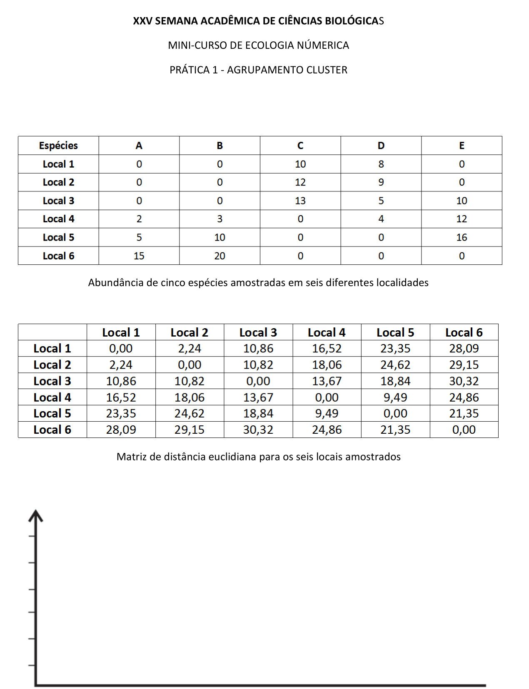

---
output:
  xaringan::moon_reader:
    css: xaringan-themer.css
    nature:
      slideNumberFormat: "%current%"
      highlightStyle: github
      highlightLines: true
      ratio: 16:9
      countIncrementalSlides: true
---
class: clear
background-image: url(fig/Slide1.PNG)
background-size: 1200px

```{css, echo = F}
h2 { color: brown; }
```

```{r xaringan-themer, include=FALSE, warning=FALSE}
library(xaringanthemer)

style_mono_accent(base_color = "#43418A", text_font_size = '20px', header_h1_font_size	 = '34px', header_h2_font_size = '32px', header_h3_font_size	= '30px')

```
---
class: clear
background-image: url(fig/Slide2.PNG)
background-size: 1200px

---
class: clear
background-image: url(fig/Slide3.PNG)
background-size: 1200px

---
class: clear
background-image: url(fig/Slide4.PNG)
background-size: 1200px

---
class: clear
background-image: url(fig/Slide5.PNG)
background-size: 1200px

---
class: clear
background-image: url(fig/Slide6.PNG)
background-size: 1200px

---
.center[
# Atividade
]

<div class="background" style="width: 1100px; height: 520px; white-space: nowrap; overflow-x: scroll; border: 0; padding: 0px;">

.center[

]

---
class: clear
background-image: url(fig/Slide7.PNG)
background-size: 1200px

---
class: clear
background-image: url(fig/Slide8.PNG)
background-size: 1200px

---
class: clear
background-image: url(fig/Slide9.PNG)
background-size: 1200px

---
class: clear
background-image: url(fig/Slide10.PNG)
background-size: 1200px

---
class: clear
background-image: url(fig/Slide11.PNG)
background-size: 1200px

---
class: clear
background-image: url(fig/Slide12.PNG)
background-size: 1200px

---
class: clear
background-image: url(fig/Slide13.PNG)
background-size: 1200px

---
class: clear
background-image: url(fig/Slide14.PNG)
background-size: 1200px

---
class: clear
background-image: url(fig/Slide15.PNG)
background-size: 1200px

---
class: clear
background-image: url(fig/Slide16.PNG)
background-size: 1200px

---
class: clear
background-image: url(fig/Slide17.PNG)
background-size: 1200px

---
# No R

## A atividade

- Uma pesquisadora 'X' contabilizou o número de indivíduos/espécie em cinco distintas áreas de conservação.

- O projeto da Dra. 'X' visa comparar essas áreas quanto a estes valores, com a finalidade de descobrir quais áreas são mais semelhantes quanto a composição de espécies.


## Instalar e carregar os pacotes necessários
```{r eval=FALSE, include=TRUE}
# Instalação
install.packages("vegan")
install.packages("kableExtra")

# Carregando os pacotes
library(vegan)
library(kableExtra)
```

```{r eval=TRUE, include=FALSE}
library(vegan)
library(kableExtra)
```

---
# No R

## Dados amostrados

### Criando a matriz de dados (comando 'matrix')
```{r}
P1 = matrix(c(0, 0, 10, 8, 0, 0, 0, 12, 9, 0, 0, 0, 13, 5, 10, 2, 3, 0, 4, 12, 5, 10, 0, 0, 16, 15, 20, 0, 0, 0), nrow = 6, byrow = 5)
```

### Nome nas colunas/linhas da matriz 
- colunas: 'colnames(nome da matriz)'
- linhas: 'rownames (nome das linhas)'

```{r}
colnames(P1)=c("A", "B", "C", "D","E")
rownames(P1)=c("Local 1", "Local 2", "Local 3", "Local 4", "Local 5","Local 6")
```

---
# No R

## Dados amostrados

### Versão final da nossa matriz/tabela

<div style="width: 1105px; height: 405px; white-space: nowrap; overflow-x: scroll; overflow-y: scroll; border: 0; padding: 0px; display: inline-block;">

```{r}
P1 %>% kbl() %>%
   kable_material(c("striped", "hover"), font_size = 20)
```

---
# No R

## Distância

### Matriz com **distância euclidiana**

- Criar a matriz de similaridade/dissimilaridade ~ mas qual distância utilizar?
- Existem dois comandos para uso com o `vegan` ~ `dist()` e o `vegdist()`.


```{r}
eu = vegdist(P1, method = "euclidean", binary = F)

eu
```

---
# No R

## Dendograma 

### Método do vizinho mais próximo ("Single linkage")

<div style="width: 1105px; height: 405px; white-space: nowrap; overflow-x: scroll; overflow-y: scroll; border: 0; padding: 0px; display: inline-block;">

```{r}
# Comando de criação de hirarquia cluster via metodo do vizinho mais próximo
vizinhop = hclust(eu, method = "single")

# Gráfico
plot(vizinhop, main = "Método do vizinho mais próximo", sub = "",
     ylab = "Distância euclidiana", xlab = "Locais", hang = -1)
```

---
# No R

## Dendograma 

### Método do vizinho mais próximo ("Single linkage")

<div style="width: 1105px; height: 405px; white-space: nowrap; overflow-x: scroll; overflow-y: scroll; border: 0; padding: 0px; display: inline-block;">

```{r}
# Gráfico
plot(vizinhop, main = "Método do vizinho mais próximo", sub = "",
     ylab = "Distância euclidiana", xlab = "Locais", hang = -1)

# 3 grupos cluster
rect.hclust(vizinhop, k=3, border="red")
```

---
# No R

## Dendograma 

### Método da ligação completa ou do vizinho mais distante ("Complete linkage") 
<div style="width: 1105px; height: 405px; white-space: nowrap; overflow-x: scroll; overflow-y: scroll; border: 0; padding: 0px; display: inline-block;">

```{r}
# Comando de criação de hierarquia cluster via método do vizinho mais distante
vizinhod = hclust(eu, method = "complete") 

# Gráfico
plot(vizinhod, main = "Método do vizinho mais distante", sub = "",
     ylab = "Distância euclidiana", xlab = "Locais", hang = -1) 
```

---
# No R

## Dendograma 

### Método da ligação completa ou do vizinho mais distante ("Complete linkage") 
<div style="width: 1105px; height: 405px; white-space: nowrap; overflow-x: scroll; overflow-y: scroll; border: 0; padding: 0px; display: inline-block;">

```{r}
# Gráfico
plot(vizinhod, main = "Método do vizinho mais distante", sub = "",
     ylab = "Distância euclidiana", xlab = "Locais", hang = -1) 

# 3 grupos cluster
rect.hclust(vizinhod, k = 3, border = "red")
```

---
# No R

## Dendograma 

### Método da ligação média ("Average linkage")

<div style="width: 1105px; height: 405px; white-space: nowrap; overflow-x: scroll; overflow-y: scroll; border: 0; padding: 0px; display: inline-block;">

```{r}
# Comando de criação de hierarquia cluster via método do vizinho mais distante
media = hclust(eu, method = "average")

# Gráfico
plot(media, main="Método da ligação média", sub="",
     ylab="Distância euclidiana", xlab="Locais", hang = -1)
```

---
# No R

## Dendograma 

### Método da ligação média ("Average linkage")

<div style="width: 1105px; height: 405px; white-space: nowrap; overflow-x: scroll; overflow-y: scroll; border: 0; padding: 0px; display: inline-block;">

```{r}
# Gráfico
plot(media, main="Método da ligação média", sub="",
     ylab="Distância euclidiana", xlab="Locais", hang = -1)

# 3 grupos cluster
rect.hclust(media, k=3, border="red")
```

---
# No R

## O cluster 

### Mas qual cluster escolher? **Vamos avaliar!**

#### Coeficiente de Correlação Cofenética

O coeficiente de correlação linear de Pearson entre os elementos da matriz de dissimilaridade (matriz de distâncias obtida dos dados) e os elementos da matriz cofenética (matriz de distâncias obtida a partir do dendrograma) é denominado *coeficiente de correlação cofenética*. 

---
# No R

## O cluster 

### Mas qual cluster escolher? **Vamos avaliar!**

#### Coeficiente de Correlação Cofenética

<div style="width: 1105px; height: 385px; white-space: nowrap; overflow-x: scroll; overflow-y: scroll; border: 0; padding: 0px; display: inline-block;">

```{r}
# Vizinho mais próximo
cor.test(eu, cophenetic(vizinhop))$estimate

# Método da ligação completa
cor.test(eu, cophenetic(vizinhod))$estimate

# Método da ligação média
cor.test(eu, cophenetic(media))$estimate
```

---
class: clear
background-image: url(fig/Slide18.PNG)
background-size: 1200px

---
.center[
# OBRIGADA!!


## Marília Melo Favalesso

`r icons::icon_style(icons::fontawesome("envelope", style = "solid"), fill = "#000000")` [mariliabioufpr@gmail.com](mariliabioufpr@gmail.com)
`r icons::icon_style(icons::fontawesome("globe-americas", style = "solid"), fill = "#000000")` [www.mmfava.com](www.mmfava.com)
`r icons::icon_style(icons::fontawesome("twitter"), fill = "#000000")` [Twitter: @mmfbee](https://twitter.com/mmfbee)
`r icons::icon_style(icons::fontawesome("github"), fill = "#000000")` [Github: mmfava](https://github.com/mmfava)
]
